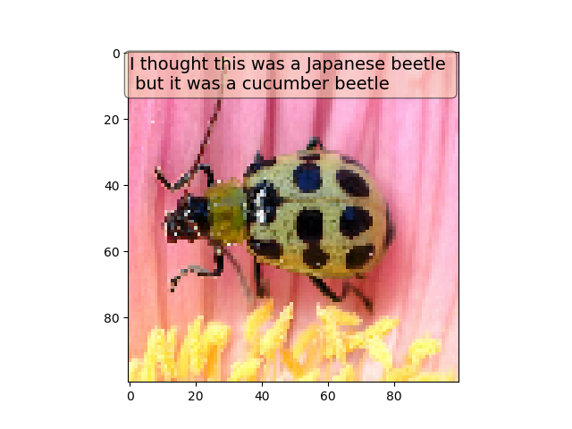

# Neural Bug Net

### Motivation

Japanese beetles are an invasive species which first came to Colorado in the early 1990s and are a pest to landscaping and some types of native plants. Interestingly, Colorado's semi-arid climate isn't naturally hospitable to this species. However, human activity such as watering lawns and planting food for them to eat (i.e. lawns and gardens) had enabled them to live in the state. The town of Palisade was able to eradicate the beetles several years ago by letting lawns dry out and pesticide application. Beetles spread on their own by about 1-5 miles a year and can also be transferred further by nursery plants. Because this pest can cause significant economic damage, tracking and preventing the spread is important.1,2

In 2017 and 2018, the Denver Museum of Nature and Science asked Coloradans to help with a beetle tracking project by submitting samples to the museum. Even with the overhead involved in submitting physical samples, 215 people contributed over 2,000 samples, producing the map below.1

Japanese Beetle distribution in Colorado 1

This project attempts to streamline this mapping process by allowing users to submit a photo of a specimen and then categorizing it as a Japanese Beetle or one of the other species of beetles endemic to Colorado. This point location data could used with other environmental data to create a species distribution model (often done using Random Forest Classifier).  

Species distribution mapping 3

### Data
For the initial model, three species of beetles were selected based on the presence of distinguishing features and availability of photos. Images were downloaded from google images and Flickr

##### Cucumber beetle: 545 images

##### Japanese beetle: 787 images

##### Ladybug: 604 images

### Cleaning
I wanted to give my initial mode "easy" images to work with. I wrote a script that displayed batches of images and recorded which indices I wanted to keep and subsequently copied them to a seperate folder. This way I was able to quickly hand sort large amounts of data. I selected images with only a single subject and also eliminated those where the subject was relatively small.

The balance of the clean dataset was:
Japanese beetles - 31%
Ladybug - 33%
Cucumber beetle - 36%

### EDA
PCA was performed on images which were downsampled to a size of 200x200x3.
The first principle component explained 31% of the variance and 120 PCA components were needed to explain 90% of the variance.

The first two principle components were plotted to look for clustering, but no clusters were obvious (red, orange and grey points represent japanese beetles, cucumber beetles and ladybugs).

Random Forest Classifier, Adaboost Classifier, Naive Bayes Classifier all optimized with Grid Search CV using 5 fold cross validatoin and balanced accuracy score (BAC) as the scoring metric (average recall for each class).

Random Forest Classifier - BAC = 0.57
Ada Boost Classififer - BAC = 0.45
Gaussian Naive Bayes - BAC = 0.43

### Model - basic CNN
The initial model was a simple CNN based loosely on the architecture of the VGG-16 neural net. Categorical crossentropy was used as a loss function.

Convolution + relu - 4x4, 32 filters
Convolution + relu - 4x4, 32 filters
Max Pooling - 2x2
Dropout 0.3
Convolution + relu- 3x3, 32 filters
Convolution + relu- 1x5, 32 filters
Convolution + relu- 5x1, 32 filters
Max Pooling - 2x2
Dropout 0.3
Flatten
Dense layer + relu
Dropout 0.3
Dense layer + softmax

Images were downsampled to 100 x 100 x 3 and preprocessed using the Xception preprocessor. Images were split into a train (487 images), test (138 images) and holdout set (65 images). Training data was augmented using shear, zoom, width shift and height shift of 0.2 and horizontal and vertical flips as available transformations.   

### Results

With the best set of weights, the balanced accuracy score on the holdout images was 95%.
Taking a look at places where the model missed, I believe it's most likely that this model is basing predictions on color and large features such as spots. This would make sense given that the model isn't very deep and the images needed to be heavily downsampled.

Possible misses based on color:

Not sure why it missed these:

### Future Directions

Because of the nature and small number of samples, this project seems like a good candidate for transfer learning using a deeper pre-trained model. This may enable generalization to the more complex images in the dataset (e.g. those containing multiple specimens).

Add location data feature and model species distribution.

Add additional species of interest. Other invasive species would be interesting to track as well as species with threatened habitat.

### References
1. http://www.dmns.org/science/museum-scientists/frank-krell/citizen-science-japanese-beetle-survey/

2. https://www.colorado.gov/pacific/agplants/japanese-beetle-colorado

3. https://www.sciencedirect.com/topics/earth-and-planetary-sciences/species-distribution-model
